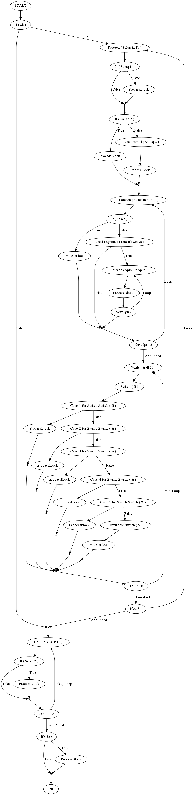

# FLowChart (Faut trouver un autre nom ! )
- ne fonctionne pour l'instant que sur des script "purs" ... pas des modules ou des scriptblock (fonctions ou autres)
- les formes sont temporaires, ainsi que le contenu des "noeuds". A terme il y aura des formes dédiés et vous pourrez setter une description, ou bien à l'aide d un block comment spécial dans votre code, automatiquement setter le contenu noeud.
-testez testez testez :)

# Nouveaux Trucs
- Vous pouvez Setter des description avec la méthode `` SetDescription($Recurse)``
- Dans le script que vous parsez, sous un statement If/foreach/Do/etc... il y a une méthode ``FindDescription()`` qui permet de trouver cette description et de la setter sur le noeud ``[node]``, voir l utilisation pour comment faire ( c'est pas encore dans les cmdlets)
```powershell
If ( $a ) {
# Description: Description Du IF
}
```


# Notes
- Commencer par build le psm1 (celui présent n est pas forcement à jour )
```
.\DirtyBuild.ps1
```

- Utilisation:
```powershell
Import-Module .\psflowchart.psm1
$a=Find-FCNodes .\plop.ps1
New-FCGraph $a

## trouver les descriptions recursivement:
$a.FindDescription($True)

## Setter des description de manière recursive:
$a.SetDescription($True)
```
Manfez c'est pret.


