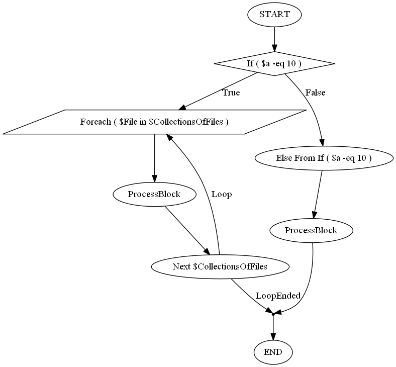

# PSFLowChart
Draw PS1 script FlowChart.
It's still a work in progress ! building the script is done manually, no tests, etc... !

## know issues
~~Condition with simple quotes, will make the graph fail for example : ``if ( $a -eq 'a'){}``~~

# How it works
The script parses a script AST, and create a list of ``nodes`` idenfying foreach/if/switch/loop statements. The output is a tree of nodes (parent, children etc... ). For Drawing, the script depends on PSGraph.

# Imporing the module
```powershell
Import-Module PsFlowChart.psm1
```

# Usage
```powershell
$x = Find-FCNode -File .\basic_example_1.ps1
$x
Type        : If
Statement   : If ( $a -eq 10 )
Description :
Children    : {ForeachNode, ElseNode}
Parent      :
Depth       : 1
File        : C:\basic_example_1.ps1
```

You can then explorer the object: ``$x.Children`` etc...

# Finding and Using Description
You can unse ``-FindDescription`` with ``-KeyWord MyCustomKeyWord`` on ``Find-FCNode`` or ``-DescriptionAsLabel`` on ``New-FCGraph``... 
By default, the script will try to find the first comment right after a statement.
Then it validates the comment againt a regex with a special keywoard (you can define it... ), wich by default is ``Description`` 
Valid Comment for identification:
```powershell
If ($a) {
# Description: this is a valid description
}
```
Non-valid Comment, unless you specify that the keyword is ``Ahahah``:
```powershell
If ($a) {
# Ahahah: this is a valid description
}
```
# Setting description
You can use ``Set-FCNodeDescription -recurse`` to set custom description recursively. By default the description is empty, unlsess you use ``-Findescription`` on ``Find-FCNode``
```powershell
PS > $x=Find-FCNode .\Code\Tests\basic_example_1.ps1 | Set-FCNodeDescription -Recurse
Set description for If ( $a -eq 10 ): DescribeMe
Set description for Foreach ( $File in $CollectionsOfFiles ): the foreach
Set description for ProcessBlock: some code
Set description for Else From If ( $a -eq 10 ):
Set description for ProcessBlock: some lines

PS C:\Temp\FLowChart-test_new_base_parsing> $x
Type        : If
Statement   : If ( $a -eq 10 )
Description : DescribeMe
Children    : {ForeachNode, ElseNode}
Parent      :
Depth       : 1
File        : C:\Code\Tests\basic_example_1.ps1

PS C:\Temp\FLowChart-test_new_base_parsing> $x[0].Children
Type        : Foreach
Statement   : Foreach ( $File in $CollectionsOfFiles )
Description : the foreach
Children    : {BlockProcess}
Parent      : IfNode
Depth       : 2
File        : C:\Code\Tests\basic_example_1.ps1

Type        : Else
Statement   : Else From If ( $a -eq 10 )
Description : Else From If ( $a -eq 10 )
Children    : {BlockProcess}
Parent      : IfNode
Depth       : 2
File        : C:\Code\Tests\basic_example_1.ps1
```

# Drawing the flowchart
```powershell
Find-FCNode -File .\basic_example_1.ps1 | New-FCGraph
```
Result :


